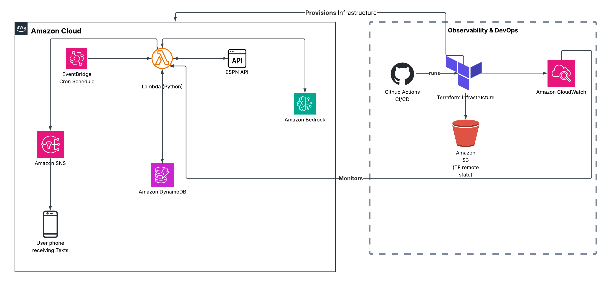

# Sports Alerts AWS Pipeline

A fully serverless, AI-powered sports alert system that automatically sends natural language SMS notifications for live EPL and NBA scores, goal scorers, and player stats — directly to your phone with no data stored on device.

---

## Architecture



---

## Teams Tracked

| Sport | Team |
|---|---|
| English Premier League (EPL) | Manchester City |
| NBA | Toronto Raptors |

---

## How It Works

1. **EventBridge** triggers Lambda every 5 minutes during game windows (EPL: 7am–6pm ET Aug–May, NBA: 4pm–midnight ET Oct–June)
2. **Lambda** fetches live scores and stats from the ESPN API
3. **DynamoDB** checks if the score changed since the last run — no duplicate alerts
4. If score changed → **Amazon Bedrock (Claude Haiku)** generates a natural language summary
5. **SNS** delivers the AI summary as an SMS to your phone

### Example SMS Alert
```
Man City beat Aston Villa 2-1 in an exciting clash! Semenyo's early volley gave 
City the lead before Watkins levelled in the 61st minute, but Haaland sealed the 
win with a late goal in the 78th. City holds on for three points.
```

---

## Tech Stack

| Layer | Technology |
|---|---|
| Language | Python 3.12 |
| Scripting | Bash / Shell scripts |
| Compute | AWS Lambda |
| Scheduler | AWS EventBridge (cron) |
| Database | AWS DynamoDB |
| AI Summaries | Amazon Bedrock (Claude Haiku 4.5) |
| Alerts | Amazon SNS (SMS) |
| Monitoring | Amazon CloudWatch |
| IaC | Terraform |
| CI/CD | GitHub Actions |
| Remote State | Amazon S3 |
| Data Source | ESPN Unofficial API (free, no key required) |

---

## Project Structure

```
sports-sns-alerts/
├── Backend/
│   └── sports_alerts.py        # Core Lambda function
├── terraform/
│   ├── main.tf                 # Provider + S3 backend
│   ├── lambda.tf               # Lambda function
│   ├── sns.tf                  # SNS topic + subscription
│   ├── iam.tf                  # IAM roles + policies
│   ├── dynamodb.tf             # DynamoDB state table
│   ├── eventbridge.tf          # Cron schedules
│   ├── cloudwatch.tf           # Alarms + log group
│   ├── variables.tf            # Input variables
│   └── outputs.tf              # Output values
├── scripts/
│   ├── deploy.sh               # Lambda packaging + deployment
│   └── tf-deploy.sh            # Terraform automation
├── .github/
│   └── workflows/
│       └── deploy.yml          # GitHub Actions CI/CD
└── assets/
    └── architecture.png        # Architecture diagram
```

---

## Alert Logic

- Lambda runs every 5 minutes during game windows
- DynamoDB stores the last known score per team
- Alert only fires when the score actually changes — no duplicate texts
- 5 CloudWatch alarms monitor Lambda health (errors, throttles, duration, invocations, SNS failures)
- AI summaries can be toggled on/off via `AI_SUMMARIES_ENABLED` flag in code

---

## CI/CD Pipeline

Every merge to `main` automatically:
1. Sets up Python 3.12
2. Configures AWS credentials via GitHub Secrets
3. Runs `terraform init` + `terraform apply`
4. Packages and deploys the Lambda function via AWS CLI

---

## Deployment

### Prerequisites
- AWS CLI configured (`aws configure`)
- Terraform installed
- Python 3.12+

### Deploy infrastructure
```bash
./scripts/tf-deploy.sh
```

### Deploy Lambda code
```bash
./scripts/deploy.sh
```

---

## Cost

| Service | Monthly Cost |
|---|---|
| AWS Lambda | $0 (free tier) |
| DynamoDB | $0 (free tier) |
| EventBridge | $0 (free tier) |
| CloudWatch | $0 (free tier) |
| Amazon Bedrock | ~$0.05 – $0.10 |
| SNS SMS (Canada) | ~$0.50 – $1.00 |
| S3 State Storage | ~$0.01 |
| **Total** | **~$1 – $2 CAD/month** |

---

## Project Phases

| Phase | Description | Status |
|---|---|---|
| 1 | ESPN API + Python data pipeline (local) | ✅ Complete |
| 2 | AWS Lambda + SNS SMS alerts | ✅ Complete |
| 3 | Terraform IaC + Shell scripts | ✅ Complete |
| 4 | EventBridge scheduling + DynamoDB state comparison | ✅ Complete |
| 5 | CloudWatch monitoring + alarms | ✅ Complete |
| 6 | GitHub Actions CI/CD pipeline + S3 remote state | ✅ Complete |
| 7 | AI-generated summaries via Amazon Bedrock | ✅ Complete |
